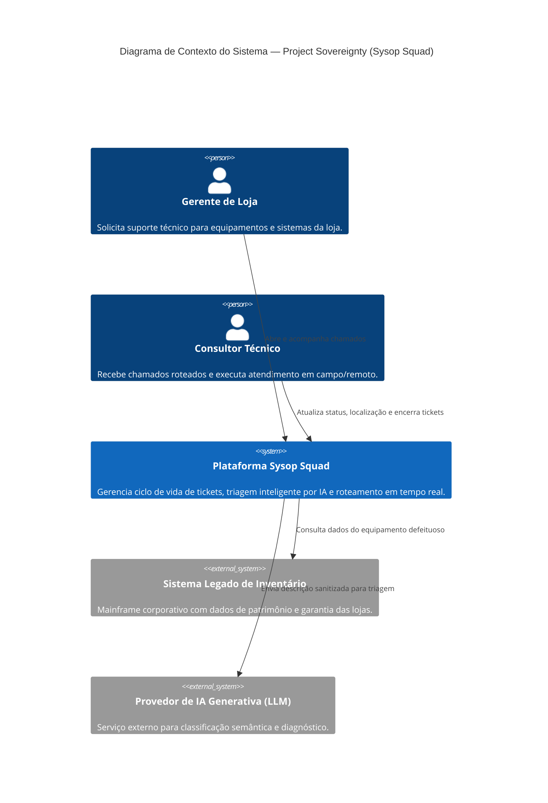

# Diagrama de Contexto (C4 - Nível 1) — Sysop Squad

```mermaid
C4Context
    title Diagrama de Contexto do Sistema — Project Sovereignty (Sysop Squad)

    Person(gerente, "Gerente de Loja", "Solicita suporte técnico para equipamentos e sistemas da loja.")
    Person(consultor, "Consultor Técnico", "Recebe chamados roteados e executa atendimento em campo/remoto.")

    System(sysop, "Plataforma Sysop Squad", "Gerencia ciclo de vida de tickets, triagem inteligente por IA e roteamento em tempo real.")

    System_Ext(legado, "Sistema Legado de Inventário", "Mainframe corporativo com dados de patrimônio e garantia das lojas.")
    System_Ext(llm, "Provedor de IA Generativa (LLM)", "Serviço externo para classificação semântica e diagnóstico.")

    Rel(gerente, sysop, "Abre e acompanha chamados")
    Rel(consultor, sysop, "Atualiza status, localização e encerra tickets")
    Rel(sysop, legado, "Consulta dados do equipamento defeituoso")
    Rel(sysop, llm, "Envia descrição sanitizada para triagem")
```
