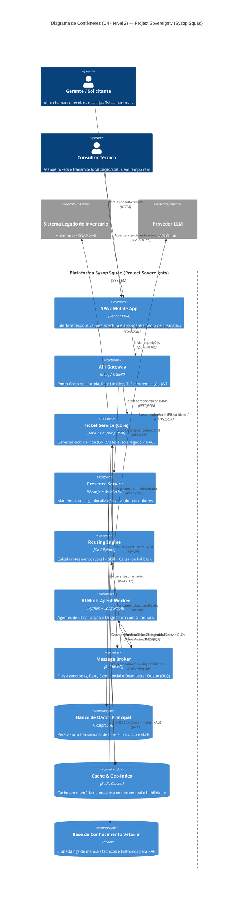

# Diagrama de Contêineres (C4 - Nível 2) — Sysop Squad

```mermaid
C4Container
    title Diagrama de Contêineres (C4 - Nível 2) — Project Sovereignty (Sysop Squad)

    Person(gerente, "Gerente / Solicitante", "Abre chamados técnicos nas lojas físicas nacionais")
    Person(consultor, "Consultor Técnico", "Atende tickets e transmite localização/status em tempo real")

    System_Boundary(sysop_boundary, "Plataforma Sysop Squad (Project Sovereignty)") {
        Container(spa, "SPA / Mobile App", "React / PWA", "Interface responsiva para abertura e acompanhamento de chamados")
        Container(gateway, "API Gateway", "Kong / NGINX", "Ponto único de entrada, Rate Limiting, TLS e Autenticação JWT")
        
        Container(ticket_svc, "Ticket Service (Core)", "Java 21 / Spring Boot", "Gerencia ciclo de vida (GoF State) e isola legado via ACL")
        Container(presence_svc, "Presence Service", "Node.js + WebSocket", "Mantém status e geolocalização ativa dos consultores")
        Container(routing_engine, "Routing Engine", "Go / Python", "Calcula roteamento (Local + Skill + Carga) ou Fallback")
        Container(ai_worker, "AI Multi-Agent Worker", "Python + LangGraph", "Agentes de Classificação e Diagnóstico com Guardrails")
        
        Container(broker, "Message Broker", "RabbitMQ", "Filas assíncronas, Retry Exponencial e Dead Letter Queue (DLQ)")
        ContainerDb(db, "Banco de Dados Principal", "PostgreSQL", "Persistência transacional de tickets, histórico e skills")
        ContainerDb(cache, "Cache & Geo-Index", "Redis Cluster", "Cache em memória de presença em tempo real e habilidades")
        ContainerDb(vector_db, "Base de Conhecimento Vetorial", "Qdrant", "Embeddings de manuais técnicos e históricos para RAG")
    }

    System_Ext(legacy_inv, "Sistema Legado de Inventário", "Mainframe / SOAP-XML", "Base corporativa de ativos e hardware das lojas")
    System_Ext(llm_provider, "Provedor LLM", "API Cloud", "Inferência semântica para classificação e diagnóstico")

    Rel(gerente, spa, "Abre e consulta tickets", "HTTPS")
    Rel(consultor, spa, "Atualiza atendimento e telemetria", "WSS / HTTPS")
    Rel(spa, gateway, "Envia requisições", "JSON/HTTPS")
    
    Rel(gateway, ticket_svc, "Roteia comandos/consultas", "REST/JSON")
    Rel(gateway, presence_svc, "Estabelece canal bidirecional", "WebSocket")

    Rel(ticket_svc, db, "Lê e persiste chamados", "JDBC/TCP")
    Rel(ticket_svc, broker, "Publica TicketCriadoEvent", "AMQP")
    Rel(ticket_svc, legacy_inv, "Consulta ativo via ACL (Adapter + Circuit Breaker)", "SOAP/XML")

    Rel(broker, ai_worker, "Consome para triagem (c/ Retry e DLQ)", "AMQP")
    Rel(ai_worker, vector_db, "Consulta soluções similares (RAG)", "gRPC")
    Rel(ai_worker, llm_provider, "Executa inferência (PII sanitizado)", "HTTPS/JSON")
    Rel(ai_worker, broker, "Publica TicketClassificadoEvent", "AMQP")

    Rel(broker, routing_engine, "Consome ticket classificado", "AMQP")
    Rel(routing_engine, cache, "Lê geolocalização e disponibilidade", "Redis Protocol")
    Rel(presence_svc, cache, "Grava telemetria em tempo real", "Redis Protocol")
    Rel(routing_engine, ticket_svc, "Atribui consultor selecionado", "REST/gRPC")
```
