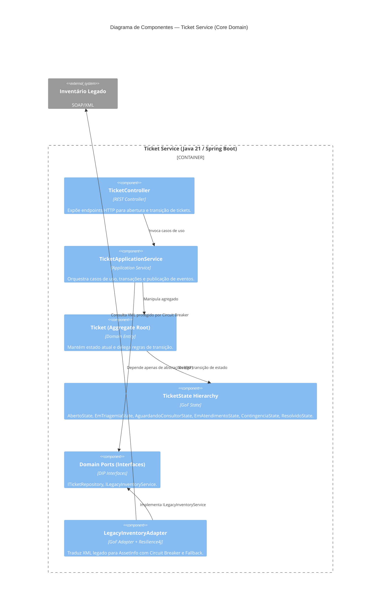

# Diagrama de Componentes (C4 - Nível 3) — Ticket Service (Core Domain)

```mermaid
C4Component
    title Diagrama de Componentes — Ticket Service (Core Domain)

    Container_Boundary(ticket_svc, "Ticket Service (Java 21 / Spring Boot)") {
        Component(controller, "TicketController", "REST Controller", "Expõe endpoints HTTP para abertura e transição de tickets.")
        Component(app_svc, "TicketApplicationService", "Application Service", "Orquestra casos de uso, transações e publicação de eventos.")
        Component(ticket_agg, "Ticket (Aggregate Root)", "Domain Entity", "Mantém estado atual e delega regras de transição.")
        Component(state_pattern, "TicketState Hierarchy", "GoF State", "AbertoState, EmTriagemIaState, AguardandoConsultorState, EmAtendimentoState, ContingenciaState, ResolvidoState.")
        Component(ports, "Domain Ports (Interfaces)", "DIP Interfaces", "ITicketRepository, ILegacyInventoryService.")
        
        Component(acl_adapter, "LegacyInventoryAdapter", "GoF Adapter + Resilience4j", "Traduz XML legado para AssetInfo com Circuit Breaker e Fallback.")
    }

    System_Ext(legado, "Inventário Legado", "SOAP/XML")

    Rel(controller, app_svc, "Invoca casos de uso")
    Rel(app_svc, ticket_agg, "Manipula agregado")
    Rel(ticket_agg, state_pattern, "Delega transição de estado")
    Rel(app_svc, ports, "Depende apenas de abstrações (DIP)")
    Rel(acl_adapter, ports, "Implementa ILegacyInventoryService")
    Rel(acl_adapter, legado, "Consulta XML protegido por Circuit Breaker")
```
